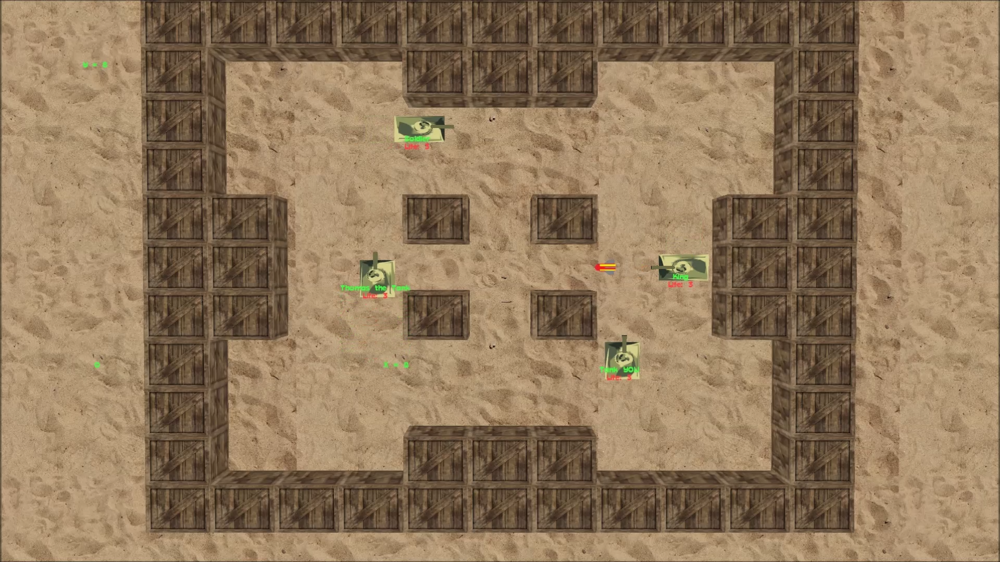

# Readme
This contains the source for the CS Games 2015 AI competition which was a tank battle. It has a game server 'GameClient' developped in C++ along with clients developped in both Python and Java.

It's shared for educationnal purpose and for fun.

## Structure

* *AIClient* Old client developped in C++, not maintained
* *AIClient_JAVA* Java declination of the ai client, up-to-date
* *AIClient_Python* Python declination of the ai client, up-to-date
* *Documentation* Manuals in french and English
* *GameClient* The game renderer
* *GameClientNoGui* The game server, without interface
* *ServerRoot* To start the communication server
* *Maya* 3D Objects

## Introduction
Some years ago this competition was one of the fierce one. Computer science guy come from all around the world to prove their courage in this insane old school computer games. Who will find the best strategy to defeat them all?

Languages: Java, Python

## What does it looks like ?

## User manual

* [In French](Documentation/Manuel-utilisateur.pdf)
* [In English](Documentation/User-manual.pdf)

## License

This code is licensed under the [MIT License](license.md).