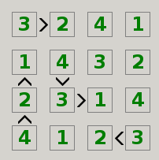
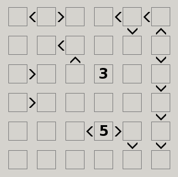

## Manuscripts of a Time Forgotten

It is said that we can learn much from fragments of the ancient world. We are sometimes able to glimpse at some esoteric pieces of lost knowledge...

Help us find out what secrets are hidden in this bizare construct. We need to know what symbols once permeated the now vacant cells, from left to right, top to bottom.

